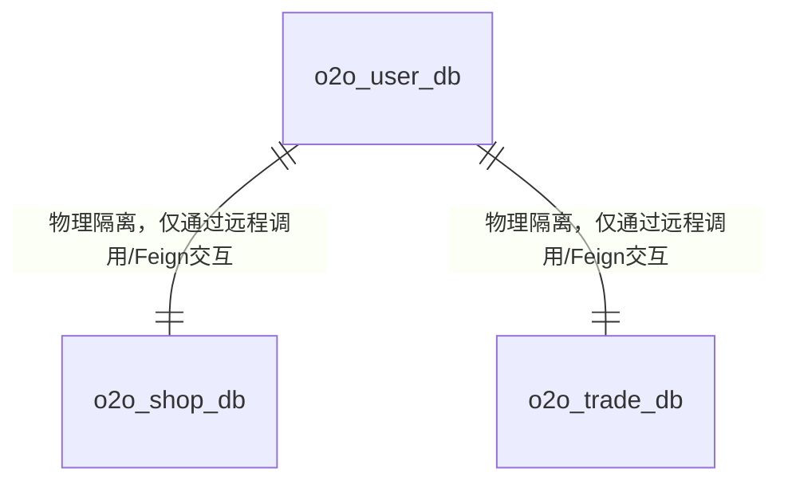

# o2o-backend 数据库表结构设计与建表 SQL (微服务独占库版)

本文档定义了 **智能 O2O 聚合电商平台 (基础版)** 的 MySQL 核心表结构。
为了符合微服务**“独占数据库 (Database-per-Service)”**的架构规范，实现服务间物理数据隔离，我们将数据划分为三个独立的数据库：
1.  **`o2o_user_db`**（由 `o2o-user-service` 独占访问）
2.  **`o2o_shop_db`**（由 `o2o-shop-service` 独占访问）
3.  **`o2o_trade_db`**（由 `o2o-trade-service` 独占访问）

---

## 🏗️ 一、 核心数据库表关系设计 (E-R 关系简图)



---

## 🔑 二、 全局数据库索引设计与作用说明

为保障微服务的高并发检索性能，并从底层拦截非法重复请求（如并发注册、重复加购），本项目在各服务隔离库表中配置了多维度索引体系。

### 1. 联合唯一索引 (Composite Unique Index)
*   **购物车表 (`tb_cart`)**：`idx_user_goods` (`user_id`, `goods_id`)
    *   **业务功能**：绑定“用户ID”与“商品ID”的联合唯一组合约束。
    *   **设计作用**：从物理层确保**“一个用户对同一件商品在购物车中仅有一条记录”**。当用户重复加购时，由该索引拦截并触发业务层 `ON DUPLICATE KEY UPDATE`（或代码累加逻辑），直接执行数量上的 `quantity = quantity + count` 累加，杜绝数据冗余。

### 2. 单列唯一索引 (Unique Index)
*   **用户表 (`tb_user`)**：`idx_username` (`username`)
    *   **设计作用**：强制保障系统用户名登录主键级唯一，防止登录重名错乱。
*   **用户表 (`tb_user`)**：`idx_phone` (`phone`)
    *   **设计作用**：强制保障用户绑定手机号全局唯一，是防范同一手机号多次注册刷券套利的基础风控设施。
*   **秒杀配置表 (`tb_seckill_goods`)**：`idx_goods_id` (`goods_id`)
    *   **设计作用**：确保一个商品在同一秒杀时间段内仅有一套活动规则，防止同一商品被并发配置多个秒杀价格。

### 3. 单列普通检索索引 (Normal Index)
针对频繁出现在 `WHERE` 过滤、`JOIN` 关联或 `ORDER BY` 排序场景中的外键/分类字段，建立单列索引以规避全表扫描，显著缩短响应延迟：
*   **地址表 (`tb_address`)**：`idx_user_id` (`user_id`) —— 加速用户加载个人收货地址簿。
*   **店铺表 (`tb_shop`)**：`idx_category` (`category`) —— 提高同城首页按分类筛选店铺的相应速度。
*   **商品表 (`tb_goods`)**：`idx_shop_id` (`shop_id`) —— 加速店铺详情页商品陈列的展示。
*   **评价表 (`tb_review`)**：`idx_shop_id` (`shop_id`) —— 支持店铺评分及汇总的高频聚合计算。
*   **订单表 (`tb_order`)**：`idx_user_id` (`user_id`) 与 `idx_shop_id` (`shop_id`) —— 支撑买家与商家订单列表的分页高速查询。
*   **订单明细表 (`tb_order_item`)**：`idx_order_id` (`order_id`) —— 支持订单详情查询时的一对多高速联表展示。

---

## 🗄️ 三、 建表 SQL 语句与字段说明

---

### 1. 用户微服务数据库 (`o2o_user_db`)

```sql
CREATE DATABASE IF NOT EXISTS `o2o_user_db` CHARACTER SET utf8mb4 COLLATE utf8mb4_unicode_ci;
USE `o2o_user_db`;
```

### 1. 用户模块

#### 1.1 用户表 (`tb_user`)
保存用户核心登录及基础资料。

```sql
DROP TABLE IF EXISTS `tb_user`;
CREATE TABLE `tb_user` (
  `id` bigint NOT NULL AUTO_INCREMENT COMMENT '用户ID，自增主键',
  `username` varchar(50) NOT NULL COMMENT '用户名/登录账号（唯一）',
  `password` varchar(100) NOT NULL COMMENT '加密后的密码',
  `phone` varchar(20) DEFAULT NULL COMMENT '手机号',
  `nickname` varchar(50) DEFAULT NULL COMMENT '昵称',
  `avatar` varchar(255) DEFAULT NULL COMMENT '头像链接',
  `status` tinyint NOT NULL DEFAULT '1' COMMENT '账号状态：0-禁用，1-正常',
  `create_time` datetime NOT NULL DEFAULT CURRENT_TIMESTAMP COMMENT '创建/注册时间',
  `update_time` datetime NOT NULL DEFAULT CURRENT_TIMESTAMP ON UPDATE CURRENT_TIMESTAMP COMMENT '最后修改时间',
  PRIMARY KEY (`id`),
  UNIQUE KEY `idx_username` (`username`),
  UNIQUE KEY `idx_phone` (`phone`)
) ENGINE=InnoDB DEFAULT CHARSET=utf8mb4 COLLATE=utf8mb4_unicode_ci COMMENT='用户基础表';
```

#### 1.2 收货地址表 (`tb_address`)
包含用户的收货地址，以及对应的 LBS 经纬度信息（同城配送需计算距离）。

```sql
DROP TABLE IF EXISTS `tb_address`;
CREATE TABLE `tb_address` (
  `id` bigint NOT NULL AUTO_INCREMENT COMMENT '地址ID，主键',
  `user_id` bigint NOT NULL COMMENT '所属用户ID',
  `receiver_name` varchar(50) NOT NULL COMMENT '收货人姓名',
  `receiver_phone` varchar(20) NOT NULL COMMENT '收货人电话',
  `province` varchar(50) DEFAULT NULL COMMENT '省份',
  `city` varchar(50) DEFAULT NULL COMMENT '城市',
  `district` varchar(50) DEFAULT NULL COMMENT '区/县',
  `detail_address` varchar(255) NOT NULL COMMENT '详细地址',
  `longitude` decimal(10,7) NOT NULL COMMENT '经度坐标 (LBS)',
  `latitude` decimal(10,7) NOT NULL COMMENT '纬度坐标 (LBS)',
  `is_default` tinyint NOT NULL DEFAULT '0' COMMENT '是否默认地址：0-否，1-是',
  `create_time` datetime NOT NULL DEFAULT CURRENT_TIMESTAMP COMMENT '创建时间',
  `update_time` datetime NOT NULL DEFAULT CURRENT_TIMESTAMP ON UPDATE CURRENT_TIMESTAMP COMMENT '更新时间',
  PRIMARY KEY (`id`),
  KEY `idx_user_id` (`user_id`)
) ENGINE=InnoDB DEFAULT CHARSET=utf8mb4 COLLATE=utf8mb4_unicode_ci COMMENT='用户收货地址表';
```

---

### 2. 店铺与商品微服务数据库 (`o2o_shop_db`)

```sql
CREATE DATABASE IF NOT EXISTS `o2o_shop_db` CHARACTER SET utf8mb4 COLLATE utf8mb4_unicode_ci;
USE `o2o_shop_db`;
```

### 2. 店铺与商品模块

#### 2.1 店铺表 (`tb_shop`)
商铺基础信息，包含经纬度，用于同城 LBS 距离排序。

```sql
DROP TABLE IF EXISTS `tb_shop`;
CREATE TABLE `tb_shop` (
  `id` bigint NOT NULL AUTO_INCREMENT COMMENT '店铺ID，主键',
  `name` varchar(100) NOT NULL COMMENT '店铺名称',
  `logo` varchar(255) DEFAULT NULL COMMENT '店铺 Logo 图片链接',
  `category` varchar(50) NOT NULL COMMENT '店铺分类，如：美食、便利店、数码、生鲜',
  `phone` varchar(20) DEFAULT NULL COMMENT '联系电话',
  `address` varchar(255) NOT NULL COMMENT '店铺地址描述',
  `longitude` decimal(10,7) NOT NULL COMMENT '经度坐标 (LBS)',
  `latitude` decimal(10,7) NOT NULL COMMENT '纬度坐标 (LBS)',
  `status` tinyint NOT NULL DEFAULT '1' COMMENT '营业状态：0-休息，1-营业中',
  `create_time` datetime NOT NULL DEFAULT CURRENT_TIMESTAMP COMMENT '创建时间',
  `update_time` datetime NOT NULL DEFAULT CURRENT_TIMESTAMP ON UPDATE CURRENT_TIMESTAMP COMMENT '更新时间',
  PRIMARY KEY (`id`),
  KEY `idx_category` (`category`)
) ENGINE=InnoDB DEFAULT CHARSET=utf8mb4 COLLATE=utf8mb4_unicode_ci COMMENT='店铺基础表';
```

#### 2.2 商品表 (`tb_goods`)
店铺内的商品数据，以及物理库存。

```sql
DROP TABLE IF EXISTS `tb_goods`;
CREATE TABLE `tb_goods` (
  `id` bigint NOT NULL AUTO_INCREMENT COMMENT '商品ID，主键',
  `shop_id` bigint NOT NULL COMMENT '所属店铺ID',
  `name` varchar(100) NOT NULL COMMENT '商品名称',
  `price` decimal(10,2) NOT NULL COMMENT '商品单价 (元)',
  `stock` int NOT NULL DEFAULT '0' COMMENT '物理库存数量',
  `image` varchar(255) DEFAULT NULL COMMENT '商品图片主图',
  `description` text COMMENT '商品图文描述',
  `status` tinyint NOT NULL DEFAULT '1' COMMENT '上架状态：0-下架，1-上架',
  `create_time` datetime NOT NULL DEFAULT CURRENT_TIMESTAMP COMMENT '创建时间',
  `update_time` datetime NOT NULL DEFAULT CURRENT_TIMESTAMP ON UPDATE CURRENT_TIMESTAMP COMMENT '更新时间',
  PRIMARY KEY (`id`),
  KEY `idx_shop_id` (`shop_id`)
) ENGINE=InnoDB DEFAULT CHARSET=utf8mb4 COLLATE=utf8mb4_unicode_ci COMMENT='商品表';
```

#### 2.3 店铺评价表 (`tb_review`)
用户对店铺的评价，用于高并发下进行 Redis 缓存统计。

```sql
DROP TABLE IF EXISTS `tb_review`;
CREATE TABLE `tb_review` (
  `id` bigint NOT NULL AUTO_INCREMENT COMMENT '评价ID，主键',
  `shop_id` bigint NOT NULL COMMENT '被评价店铺ID',
  `user_id` bigint NOT NULL COMMENT '评价用户ID',
  `score` tinyint NOT NULL DEFAULT '5' COMMENT '评分：1至5星',
  `content` text COMMENT '文字评价内容',
  `create_time` datetime NOT NULL DEFAULT CURRENT_TIMESTAMP COMMENT '创建时间',
  PRIMARY KEY (`id`),
  KEY `idx_shop_id` (`shop_id`)
) ENGINE=InnoDB DEFAULT CHARSET=utf8mb4 COLLATE=utf8mb4_unicode_ci COMMENT='店铺评价表';
```

---

### 3. 交易与秒杀微服务数据库 (`o2o_trade_db`)

```sql
CREATE DATABASE IF NOT EXISTS `o2o_trade_db` CHARACTER SET utf8mb4 COLLATE utf8mb4_unicode_ci;
USE `o2o_trade_db`;
```

### 3. 交易与秒杀模块

#### 3.1 订单表 (`tb_order`)
普通商品及秒杀订单的主表。

```sql
DROP TABLE IF EXISTS `tb_order`;
CREATE TABLE `tb_order` (
  `id` bigint NOT NULL COMMENT '订单ID（建议用雪花算法或分布式ID，不推荐用MySQL自增）',
  `user_id` bigint NOT NULL COMMENT '下单用户ID',
  `shop_id` bigint NOT NULL COMMENT '商铺ID',
  `total_amount` decimal(10,2) NOT NULL COMMENT '订单总金额 (元)',
  `status` tinyint NOT NULL DEFAULT '0' COMMENT '订单状态：0-待付款，1-已付款待接单，2-配送中，3-已送达，4-已取消',
  `receiver_name` varchar(50) NOT NULL COMMENT '收货人',
  `receiver_phone` varchar(20) NOT NULL COMMENT '收货电话',
  `receiver_address` varchar(255) NOT NULL COMMENT '收货地址',
  `pay_time` datetime DEFAULT NULL COMMENT '支付时间',
  `create_time` datetime NOT NULL DEFAULT CURRENT_TIMESTAMP COMMENT '下单时间',
  `update_time` datetime NOT NULL DEFAULT CURRENT_TIMESTAMP ON UPDATE CURRENT_TIMESTAMP COMMENT '更新时间',
  PRIMARY KEY (`id`),
  KEY `idx_user_id` (`user_id`),
  KEY `idx_shop_id` (`shop_id`)
) ENGINE=InnoDB DEFAULT CHARSET=utf8mb4 COLLATE=utf8mb4_unicode_ci COMMENT='订单主表';
```

#### 3.2 订单详情表 (`tb_order_item`)
记录单笔订单下包含的商品详情明细。

```sql
DROP TABLE IF EXISTS `tb_order_item`;
CREATE TABLE `tb_order_item` (
  `id` bigint NOT NULL AUTO_INCREMENT COMMENT '主键',
  `order_id` bigint NOT NULL COMMENT '所属订单ID',
  `goods_id` bigint NOT NULL COMMENT '商品ID',
  `goods_name` varchar(100) NOT NULL COMMENT '商品快照名',
  `price` decimal(10,2) NOT NULL COMMENT '购买单价',
  `quantity` int NOT NULL DEFAULT '1' COMMENT '购买数量',
  PRIMARY KEY (`id`),
  KEY `idx_order_id` (`order_id`)
) ENGINE=InnoDB DEFAULT CHARSET=utf8mb4 COLLATE=utf8mb4_unicode_ci COMMENT='订单详情明细表';
```

#### 3.3 秒杀优惠券/商品配置表 (`tb_seckill_goods`)
专门存放秒杀活动的库存和时间限制。

```sql
DROP TABLE IF EXISTS `tb_seckill_goods`;
CREATE TABLE `tb_seckill_goods` (
  `id` bigint NOT NULL AUTO_INCREMENT COMMENT '秒杀配置ID，主键',
  `goods_id` bigint NOT NULL COMMENT '对应商品ID',
  `seckill_price` decimal(10,2) NOT NULL COMMENT '秒杀活动专属价格',
  `seckill_stock` int NOT NULL DEFAULT '0' COMMENT '秒杀活动专用库存',
  `start_time` datetime NOT NULL COMMENT '秒杀开始时间',
  `end_time` datetime NOT NULL COMMENT '秒杀结束时间',
  `create_time` datetime NOT NULL DEFAULT CURRENT_TIMESTAMP,
  `update_time` datetime NOT NULL DEFAULT CURRENT_TIMESTAMP ON UPDATE CURRENT_TIMESTAMP,
  PRIMARY KEY (`id`),
  UNIQUE KEY `idx_goods_id` (`goods_id`)
) ENGINE=InnoDB DEFAULT CHARSET=utf8mb4 COLLATE=utf8mb4_unicode_ci COMMENT='秒杀商品活动配置表';
```

---

### 4. 购物车微服务数据库 (`o2o_cart_db`)

```sql
CREATE DATABASE IF NOT EXISTS `o2o_cart_db` CHARACTER SET utf8mb4 COLLATE utf8mb4_unicode_ci;
USE `o2o_cart_db`;
```

#### 4.1 购物车表 (`tb_cart`)
保存用户购物车暂存数据。

```sql
DROP TABLE IF EXISTS `tb_cart`;
CREATE TABLE `tb_cart` (
  `id` bigint NOT NULL AUTO_INCREMENT COMMENT '主键',
  `user_id` bigint NOT NULL COMMENT '用户ID',
  `goods_id` bigint NOT NULL COMMENT '商品ID',
  `quantity` int NOT NULL DEFAULT '1' COMMENT '加购数量',
  `create_time` datetime NOT NULL DEFAULT CURRENT_TIMESTAMP,
  `update_time` datetime NOT NULL DEFAULT CURRENT_TIMESTAMP ON UPDATE CURRENT_TIMESTAMP,
  PRIMARY KEY (`id`),
  UNIQUE KEY `idx_user_goods` (`user_id`, `goods_id`) -- 联合唯一索引，确保一个用户对一个商品只有一条记录
) ENGINE=InnoDB DEFAULT CHARSET=utf8mb4 COLLATE=utf8mb4_unicode_ci COMMENT='购物车持久化表';
```
```
