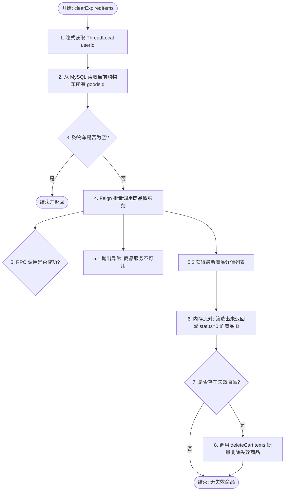
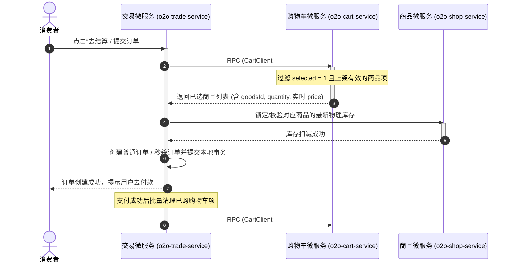

# 购物车微服务 (o2o-cart-service) 核心业务与架构设计总结

本文档总结了智能 O2O 聚合电商平台中**购物车微服务**的核心业务逻辑、高性能双写缓存设计、勾选状态管理以及下单结算联动机制，为开发运维及系统审计提供设计依据。

---

## 1. 业务与架构定位：独立拆分，缓存优先

为了支撑高并发、低延迟的购物车操作，并解耦用户服务，系统将购物车业务独立拆分为物理隔离的微服务 `o2o-cart-service`（运行端口 8085，Nacos 注册名 `o2o-cart-service`）。

### 1.1 存储选型决策：Redis + MySQL 同步双写
购物车属于**高频读写、低延迟敏感、且数据具备一定留存价值**的业务。我们舍弃了“单 MySQL”和“单 Redis”方案，采用了 **“MySQL (数据持久化底盘) + Redis (高并发极速读写)”** 的同步双写架构：

| 评估维度 | 单 MySQL 持久化方案 | 单 Redis 纯缓存方案 | Redis + MySQL 同步双写（最终采纳） |
| :--- | :--- | :--- | :--- |
| **读写吞吐量** | 低。频繁的增删改查对 MySQL 造成大量随机 I/O，极易成为瓶颈。 | **极高**。所有操作在内存中进行，QPS 可达数万级。 | **极高**。读流量 100% 走 Redis，写流量同步双写保证可靠性。 |
| **数据可靠性** | **高**。事务保护，断电不丢失，确保数据安全。 | **差**。若内存溢出 Key 被逐出或 Redis 重启，用户购物车将全部丢失。 | **高**。以 MySQL 作为持久化数据底盘，即便 Redis 宕机，也可随时回源预热。 |
| **网络开销** | 每次操作需与数据库进行 TCP 连接与事务交互，延迟较高。 | 极低。Redis 内存操作，响应级别在毫秒以内。 | **低延迟**。主操作极速响应，Redis 写入失败时降级直写 DB。 |
| **跨设备同步** | 支持。通过账号登录后直接查库。 | 较差。若未做持久化同步，Key 过期或清理后即无法找回。 | **完美**。通过 `userId` 全渠道关联，兼顾性能与跨设备一致性。 |

---

## 2. 数据库设计与物理幂等保障 (MySQL)

### 2.1 数据库定义与表结构
购物车库物理隔离命名为 `o2o_cart_db`，由 `o2o-cart-service` 独占。其核心关联表为 `tb_cart`：

```sql
CREATE DATABASE IF NOT EXISTS `o2o_cart_db` CHARACTER SET utf8mb4 COLLATE utf8mb4_unicode_ci;
USE `o2o_cart_db`;

DROP TABLE IF EXISTS `tb_cart`;
CREATE TABLE `tb_cart` (
  `id` bigint NOT NULL AUTO_INCREMENT COMMENT '购物车ID，自增主键',
  `user_id` bigint NOT NULL COMMENT '用户ID',
  `goods_id` bigint NOT NULL COMMENT '商品ID',
  `quantity` int NOT NULL DEFAULT '1' COMMENT '商品数量',
  `selected` tinyint NOT NULL DEFAULT '1' COMMENT '是否选中：0-未选中，1-选中',
  `create_time` datetime NOT NULL DEFAULT CURRENT_TIMESTAMP COMMENT '创建时间',
  `update_time` datetime NOT NULL DEFAULT CURRENT_TIMESTAMP ON UPDATE CURRENT_TIMESTAMP COMMENT '更新时间',
  PRIMARY KEY (`id`),
  UNIQUE KEY `uni_user_goods` (`user_id`, `goods_id`), -- 联合唯一索引：物理幂等防重复
  KEY `idx_user_id` (`user_id`)                       -- 快速检索用户的购物车
) ENGINE=InnoDB DEFAULT CHARSET=utf8mb4 COLLATE=utf8mb4_unicode_ci COMMENT='购物车商品关联表';
```

### 2.2 索引设计考量与物理幂等性
* **联合唯一索引 `uni_user_goods` (`user_id`, `goods_id`)**：
  * **设计初衷**：在实际高并发网络环境中，消费者连击加购、网络重试或者脚本刷接口极易引起数据库并发 `INSERT` 踩踏。
  * **解决原理**：建立联合唯一索引能在数据库底盘强制约束“一个用户针对一件商品在数据库只有一条购物车项”。即使并发请求绕过了 Java 业务层 `selectOne` 校验，数据库也会抛出唯一约束冲突异常，强制拦截并保证了**物理幂等性**。
* **单列普通索引 `idx_user_id` (`user_id`)**：
  * 用于加速查询特定用户名下的所有购物车条目，避免购物车缓存失效或冷启动回源查询时产生全表扫描。

---

## 3. Redis 缓存结构与勾选状态设计

购物车在 Redis 缓存中的核心设计是**将商品数量与勾选状态分离存储**：

```text
o2o:cart:{userId} (Hash 结构) ── 用于存储商品及数量
  ├── Field: {goodsId1} ── Value: {quantity1}
  └── Field: {goodsId2} ── Value: {quantity2}

o2o:cart:selected:{userId} (Set 结构) ── 用于存储被勾选的商品ID
  ├── Member: {goodsId1}
  └── Member: {goodsId2}
```

### 3.1 为什么将“勾选状态”设计为独立的 Set 结构？
我们曾深入评估过将选中状态整合入 Hash 值的“JSON 串方案”与“Set 分离方案”：

| 评估维度 | 方案一：Hash Value 存储 JSON 串（如 `{"q":2, "s":1}`） | 方案二：Hash (存数量) + Set (存勾选商品) [最终采纳] |
| :--- | :--- | :--- |
| **自增原子性** | **差**。修改数量不能直接使用 `HINCRBY`，必须在 Java 端读出、解析 JSON、累加并写回，在高并发加购下存在并发脏写覆盖。 | **极佳**。更新商品数量时，直接使用 Redis 原生的 `HINCRBY` 保证强原子性与绝对性能。 |
| **操作复杂度** | 较高。任何加购、勾选操作都需要序列化和反序列化 JSON，占用 CPU。 | 极简。勾选直接 `SADD selectedKey goodsId`，取消直接 `SREM`。 |
| **获取选中商品** | 需拉取 Hash 全量数据并在 Java 内存中反序列化过滤，开销较大。 | **极快**。直接 `SMEMBERS selectedKey` 获取全部选中 ID，无需遍历。 |
| **Key 维护成本** | 低。只维护 1 个 Redis Key 即可。 | 稍高。需要同时维护 2 个 Key，但通过工具类将过期时间设为一致（30天）可以完美解决。 |

### 3.2 强事务一致性保障 (延后写缓存)
由于微服务采用了 MySQL + Redis 双写，为了防范 **“写缓存成功但写 MySQL 事务回滚”** 导致的缓存脏数据与弱一致性漏洞，我们引入了基于 Spring 事务同步机制的延后写缓存设计：
* **延迟写入机制**：写操作时（加购、更新数量、单品/批量删除、清空），**先操作 MySQL 数据库**。
* **事务挂载监听**：引入 `TransactionSynchronizationManager`。若当前执行线程中存在活跃的 Spring 声明式事务，则将 Redis 写入/删除逻辑封装为同步钩子，注册在事务提交成功后（`afterCommit` 回调阶段）触发执行。
* **回滚安全性**：如果 MySQL 发生任何异常导致事务回滚，`afterCommit` 钩子不会被触发，Redis 缓存依然维持原状，彻底消除了事务回滚引发的缓存脏数据隐患。

---

## 4. 核心业务流程流转设计

### 4.1 加购商品流程 (`addCartItem`)
当用户在前端发起加购请求时，业务流程如下（已接入事务同步器）：

```mermaid
graph TD
    Start([开始: addCartItem]) --> CheckParam[1. 校验入参 goodsId, quantity > 0]
    CheckParam --> GetUser[2. 隐式获取 ThreadLocal userId]
    GetUser --> QueryDB[3. 查询 MySQL 中是否已有记录]
    QueryDB --> Exists{4. 记录是否存在?}
    Exists -- "是" --> UpdateDB[5. UPDATE 累加数量 & 置为 selected = 1]
    Exists -- "否" --> InsertDB[6. INSERT 插入新购物车行 (selected = 1)]
    UpdateDB --> CommitTX{7. 数据库事务成功提交?}
    InsertDB --> CommitTX
    CommitTX -- "否 (事务回滚)" --> Rollback[8.1 DB回滚, Redis写入跳过]
    Rollback --> EndFailed([加购失败])
    CommitTX -- "是 (afterCommit触发)" --> WriteRedis[8.2 写入 Redis 缓存]
    
    subgraph Redis延后双写
        WriteRedis --> RedisHash[8.2.1 HINCRBY 累加数量]
        WriteRedis --> RedisSet[8.2.2 SADD 添加勾选状态]
        RedisHash --> SetTTL[8.2.3 重设 Hash & Set 生存期 30天]
        RedisSet --> SetTTL
    end
    SetTTL --> EndSuccess([加购成功])
```


### 4.2 购物车勾选状态变更流程 (`updateSelectStatus`)
此流程覆盖单品勾选/取消勾选，以及全选/全不选（采用先写 MySQL 后写 Redis 的事务同步机制）：

```mermaid
graph TD
    Start([开始: updateSelectStatus]) --> CheckParam[1. 校验 selected 状态为 0 或 1]
    CheckParam --> CheckSingle{2. 是否为单品勾选?}
    
    CheckSingle -- "是 (goodsId != null)" --> SingleDB[3.1 MySQL: UPDATE set selected = ? WHERE goodsId = ?]
    SingleDB --> CommitTX{4. 事务成功提交?}
    
    CheckSingle -- "否 (goodsId == null)" --> CheckAll{3.2 是否为全选?}
    CheckAll -- "全选 (selected = 1)" --> DBUpdateAll[3.2.1 MySQL: UPDATE set selected = 1]
    CheckAll -- "全不选 (selected = 0)" --> DBUpdateNone[3.2.2 MySQL: UPDATE set selected = 0]
    DBUpdateAll --> CommitTX
    DBUpdateNone --> CommitTX
    
    CommitTX -- "是 (afterCommit触发)" --> CheckRedisSingle{5. 是否为单品勾选?}
    CheckRedisSingle -- "是" --> SingleRedis[5.1 Redis: SADD / SREM goodsId]
    CheckRedisSingle -- "否" --> CheckRedisAll{5.2 是否为全选?}
    CheckRedisAll -- "全选" --> RedisAddAll[5.2.1 获取 Hash 所有 keys, SADD 写入 Set]
    CheckRedisAll -- "全不选" --> RedisDel[5.2.2 DEL 直接删除整个 Set]
    
    SingleRedis --> End([状态同步完成])
    RedisAddAll --> End
    RedisDel --> End


### 4.3 购物车列表拉取与 RPC 装配流程 (`getCartList`)
由于购物车仅在 Redis 中存放了 `goodsId` 和数量，列表拉取时必须调用 `o2o-shop-service` 进行商品信息整合以确保价格和上下架状态的绝对实时：

```mermaid
graph TD
    Start([开始: getCartList]) --> ReadCache[1. 从 Redis 读取 Hash 购物车元数据]
    ReadCache --> HitCache{2. 缓存是否命中?}
    
    HitCache -- "否 (缓存为空)" --> QueryDB[3.1 从 MySQL 获取该用户购物车列表]
    QueryDB --> CheckEmpty{3.2 列表为空?}
    CheckEmpty -- "是" --> ReturnEmpty([返回空列表])
    CheckEmpty -- "否" --> WarmUp[3.3 将数据回写/预热到 Redis Hash & selected Set]
    
    HitCache -- "是" --> QueryDBStruct[4.1 从 MySQL 查询列表以获取 tb_cart 的自增主键 ID]
    QueryDBStruct --> Overwrite[4.2 读取 Redis selected Set, 用缓存数据覆盖并重置 quantity 和 selected 状态]
    
    WarmUp --> CollectIds[5. 收集购物车中的 goodsId 列表]
    Overwrite --> CollectIds
    CollectIds --> FeignCall[6. Feign 批量调用 shop-service 批量获取商品详情]
    FeignCall --> MapData[7. 内存中将商品名, 价格, 图片, 上下架状态与加购数量进行装配]
    MapData --> ReturnVo([返回 CartVo 列表])

### 4.4 下单支付后的批量清理流程 (`deleteCartItems`)
为了避免用户下单多个商品后，交易服务循环发起单个 RPC 调用进行购物车删除，造成极高的网络 I/O 损耗与数据库随机写入压力，购物车服务提供了高效的批量清理接口。其内部实现机制如下：

1. **Redis 端高效清理**：
   * 将 `List<Long> goodsIds` 转为 String 类型的数组。
   * 调用 `stringRedisTemplate.opsForHash().delete(cartKey, fields...)` 批量从数量 Hash 中移除商品 Field。
   * 调用 `stringRedisTemplate.opsForSet().remove(selectedKey, fields...)` 批量从选中状态 Set 中移除对应商品，实现 1 次网络交互完成全部 Redis 项的清理。
2. **MySQL 端 IN 批量物理删除**：
   * 在持久层通过执行批量删除语句完成一键清除，避免了多事务循环执行：
     ```sql
     DELETE FROM tb_cart WHERE user_id = ? AND goods_id IN (101, 102, ...);
     ```

```mermaid
graph TD
    Start([开始: deleteCartItems]) --> CheckParam[1. 校验 goodsIds 列表不为空]
    CheckParam --> GetUser[2. 隐式获取 ThreadLocal userId]
    GetUser --> RedisDel[3. Redis 批量清理]
    
    subgraph Redis 批量清理
        RedisDel --> RedisHash[3.1 opsForHash.delete 批量移除商品]
        RedisDel --> RedisSet[3.2 opsForSet.remove 批量移除选中状态]
    end
    
    RedisHash --> MySQLDel[4. MySQL 批量删除]
    RedisSet --> MySQLDel
    
    subgraph MySQL 批量清理
        MySQLDel --> DBDelete[执行 DELETE FROM tb_cart WHERE user_id = ? AND goods_id IN (...)]
    end
    
    DBDelete --> End([批量清理成功])
```

### 4.5 一键清理失效商品流程 (`clearExpiredItems`)
为保持购物车数据整洁，系统提供了一键清理失效（已下架或已被商家物理删除）商品的功能。该流程跨服务联动细节如下：

1. **拉取本地购物车元数据**：
   从 MySQL 的 `tb_cart` 表中读取当前用户购物车内的全部 `goodsId` 集合。
2. **Feign 批量查询状态**：
   跨服务发起批量 RPC 查询（`GoodsClient#getGoodsByIds`），从 `o2o-shop-service` 获取商品的最新详情（包括上架状态 `status`）。
3. **交叉比对确定失效集**：
   在内存中比对本地 `goodsId` 与 RPC 响应结果。如果某个商品在响应中不存在（商品被商家从后台删除），或者其 `status == 0`（已被下架），则将其归入 `expiredGoodsIds` 失效商品集。
4. **事务双写清理**：
   若失效商品集不为空，调用批量删除 `deleteCartItems(expiredGoodsIds)`：
   * **MySQL**：执行 `DELETE ... WHERE goods_id IN (...)` 批量物理清除。
   * **Redis (afterCommit 后触发)**：使用 `opsForHash().delete` 和 `opsForSet().remove` 清理对应的购物车数量与勾选状态，仅做 1 次网络开销。



---

## 5. 分布式鉴权与身份上下文透传

系统遵循**“网关统一拦截验签 + 下游微服务无感透传”**的身份安全规范：
1. **网关统一清洗**：`o2o-gateway` 拦截所有传入请求，自动剔除客户端伪造的 `X-User-Id` 头，解密 JWT Token 后，将解析出的真实 `userId` 注入 `X-User-Id` 请求头透传给下游。
2. **拦截器隐式装配**：`o2o-cart-service` 注册 `UserContextInterceptor`，拦截请求并调用 `UserContext.setUserId(...)` 将用户 ID 绑定到当前 Tomcat 工作线程的 `ThreadLocal` 变量中，执行完毕后在 `afterCompletion` 中清空以防止内存泄漏和线程复用污染。
3. **RPC 身份链式传递**：购物车服务在拉取列表时需要 Feign 远程调用商品服务。为避免身份丢失，系统配置了 `FeignHeaderInterceptor`，在 RPC 请求发出前自动获取当前线程上下文 `UserContext` 里的 `X-User-Id` 并注入到 Feign 的请求头中，完成全链路无感透传。
4. **控制层强安全机制**：`CartController` 的接口（如加购、获取列表等）均**严禁直接从 RequestBody 或 URL Query 中接收 `userId`**，而是一律调用 `UserContext.getUserId()` 隐式获取，彻底避免了横向越权漏洞。

---

## 6. 与交易微服务 (`o2o-trade-service`) 的结算联动机制

勾选状态管理的核心目的在于支持**交易下单流**。以下是交易微服务结算时，两个微服务间的交互时序：


