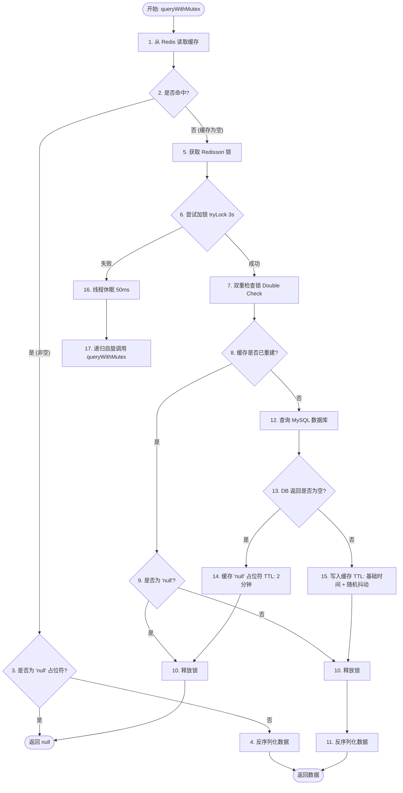
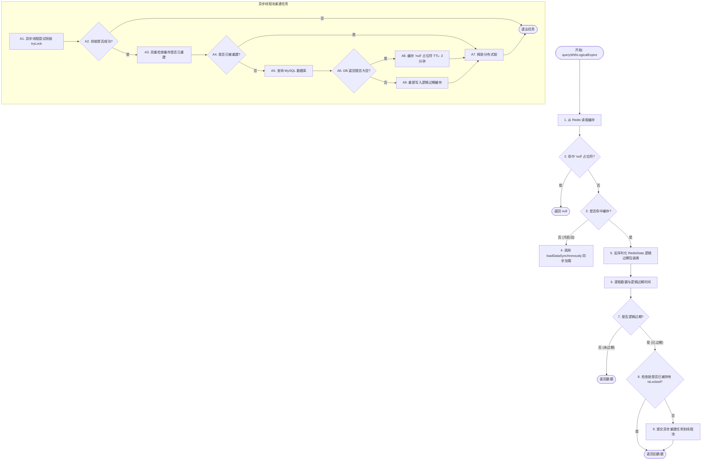
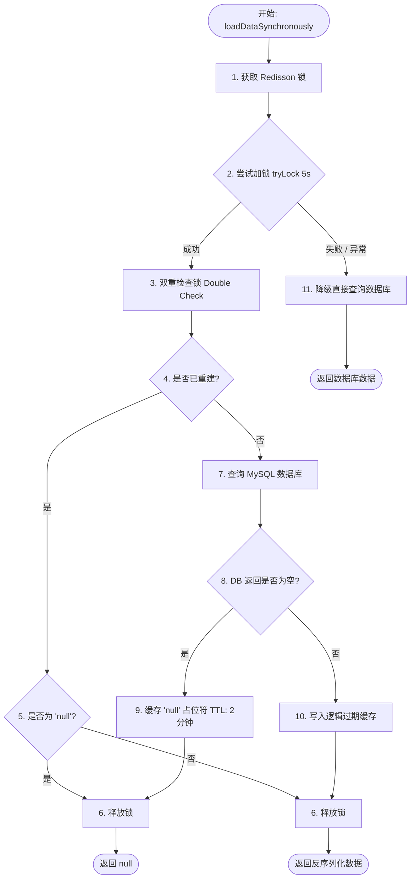

# 店铺与商品微服务 (o2o-shop-service) 核心业务与架构设计总结

本文档总结了智能 O2O 聚合电商平台中**店铺与商品微服务**的核心业务逻辑、多端解耦架构设计以及数据安全防越权方案，为后续开发与系统审计提供设计依据。

---

## 1. 业务与架构定位：领域内聚，逻辑隔离（RuoYi-Cloud 风格）

为了防止微服务“模块爆炸”并减轻早期系统编译、部署与运维的物理开销，我们采用**“单一微服务 + 包级逻辑隔离”**的架构设计，即只用一个 `o2o-shop-service` 微服务（端口 8082）处理整个店铺和商品域。

通过在包结构和接口路由层面的彻底划分，实现了 C端消费者（只读）与 B端商家（管理写）的完美隔离：

### 1.1 架构对比与选型决策

| 评估维度 | 逻辑分包隔离（最终采纳） | 物理微服务拆分（o2o-shop-portal & admin） |
| :--- | :--- | :--- |
| **工程膨胀度** | **低**。仅保留 1 个微服务，业务高度内聚。 | **高**。裂变为 3 个子模块，导致 pom 依赖与配置爆炸。 |
| **运行开销** | **小**。仅需 1 个 Spring Boot 进程，节省内存资源。 | **大**。需要启动 2 个 JVM 进程，资源开销翻倍。 |
| **开发协作** | **顺畅**。代码集中在单一工程，避免跨模块引用的循环依赖。 | **繁琐**。需在多模块间频繁切换，同步依赖版本成本高。 |
| **网关路由** | **极简**。网关只配置一条 `/api/shop/**` 规则路由，前台统一。 | **复杂**。网关需分流路由到两个不同端口的服务，配置繁多。 |
| **性能扩展性** | **高**。支持通过数据库**主从读写分离**及 Redis/ES 缓存进行性能隔离。 | **物理隔离**。进程级隔离，但存在过度设计。 |

---

## 2. 代码结构与分包隔离规范

在 `o2o-shop-service` 内部，Controller 和 Service 被严密地划分为 `customer`（客户端）与 `merchant`（商家端）包目录：

```text
o2o-shop-service
├── src/main/java/com/o2o/shop
│   ├── controller
│   │   ├── customer                # C端消费者接口 (RequestMapping: /shop/customer/**)
│   │   │   ├── GoodsCustomerController.java   (获取指定店铺上架商品)
│   │   │   ├── ShopCustomerController.java    (获取店铺详情/分页筛选列表)
│   │   │   └── ReviewCustomerController.java  (消费者发表/分页查看商品评价)
│   │   └── merchant                # B端商家管理接口 (RequestMapping: /shop/merchant/**)
│   │       ├── GoodsMerchantController.java  (商家添加与上架商品)
│   │       └── ShopMerchantController.java   (商家创建与更新店铺信息)
│   │
│   ├── service
│   │   ├── customer                # C端只读/操作业务逻辑
│   │   │   ├── GoodsCustomerService.java & impl
│   │   │   ├── ShopCustomerService.java & impl
│   │   │   └── ReviewCustomerService.java & impl
│   │   └── merchant                # B端商家写业务逻辑 (防越权校验核心)
│   │       ├── GoodsMerchantService.java & impl
│   │       └── ShopMerchantService.java & impl
│   │
│   ├── entity                      # 实体对象层 (Shop.java, Goods.java, Review.java)
│   ├── vo                          # 视图传输对象层 (ReviewVo.java)
│   └── mapper                      # 统一数据访问层 (ShopMapper.java, GoodsMapper.java, ReviewMapper.java)
```

---

## 3. `owner_id` 的防越权获取方式选型

为防止“商家A横向越权操作商家B的店铺”，接口必须校验操作者与商铺的所有权。我们对如何获取并校验 `owner_id`（商铺主人）进行了深度论证：

### 3.1 方案对比与选型依据

| 评估维度 | 方式一：实时数据库/Redis 缓存查询 (最终采纳) | 方式二：在 JWT Token 载荷 (Payload) 中直接塞入 `shopId` |
| :--- | :--- | :--- |
| **实时生效性** | **高**。店铺绑定关系、启用状态一旦在库中更新，**下一秒请求立刻生效**，安全防护无死角。 | **低**。JWT 签发后不可变。绑定变更时，必须等 Token 过期或强迫商家退登重签，存在安全空窗期。 |
| **系统域耦合** | **低**。鉴权服务（`o2o-user-service`）只认人，不干涉店铺业务，微服务限界上下文边界清晰。 | **高**。用户服务签发 Token 时必须跨域查询店铺关系，造成服务间强耦合。 |
| **多店铺支持** | **好**。一个商家账号绑定多家店铺（如连锁分店）时，通过关系表可轻松适配。 | **差**。若商家绑定十多个店铺，写入 JWT 会使 Token 头部急剧膨胀甚至撑爆 Header。 |
| **数据库压力** | **极低开销**。B端修改商品的频率极低。且可通过 Redis 缓存（缓存 key: `o2o:shop:owner:{userId}`）进行提速。 | **无开销**。网关解析 Token 即可拿到，不需要任何查询。 |

### 3.2 最终防越权校验逻辑与分布式 Header 传递
我们选择**“网关统一鉴权 + 头部信息透传 (Header Propagation)”**的安全模型：
1. **网关透传**：网关验证 Token 合法后，提取 `userId`，并在请求头中隐式注入 `X-User-Id`。
2. **拦截器装配**：`o2o-shop-service` 注册 `UserContextInterceptor`，自动提取该头并写入 `ThreadLocal` 的 `UserContext` 中，请求结束时自动清理，防止线程复用污染。
3. **分布式 Header 传递**：当 `o2o-shop-service` 需要通过 Feign 远程调用下游微服务时，由于 Feign 作为一个独立的 HTTP 客户端会丢失原始 Header，系统注册了 `FeignHeaderInterceptor`，在 RPC 请求发出前自动获取当前线程上下文 `UserContext` 里的 `X-User-Id` 并注入到 Feign 的请求头中，完成全调用链路的身份信息零感知自动透传。
4. **业务层强校验**：
   - **未传 shopId**：后端自动执行 `SELECT id FROM tb_shop WHERE owner_id = currentUserId`，将查出的 `shopId` 强制赋值给商品，防止商家随意挂靠。
   - **传了 shopId**：后端获取店铺元数据后校验 `shop.getOwnerId().equals(currentUserId)`。一旦不匹配，立刻抛出 `403 Forbidden` 异常。

---

## 4. 网关路由与接口映射

`o2o-gateway` 采用扁平化的单路路由配置，由微服务内部路由前缀进行细化拦截：

```yaml
spring:
  cloud:
    gateway:
      routes:
        # 店铺微服务路由
        - id: shop-service-route
          uri: lb://o2o-shop-service
          predicates:
            - Path=/api/shop/**
          filters:
            - StripPrefix=1
```

* **C端请求路由路径**：`GET /api/shop/customer/**` ➡️ 网关剥离 `/api` ➡️ 转发下游 `/shop/customer/**`。
* **B端请求路由路径**：`POST/PUT /api/shop/merchant/**` ➡️ 网关剥离 `/api` ➡️ 转发下游 `/shop/merchant/**`。

---

## 5. 店铺与评价基础 CRUD 接口规范

### 5.1 店铺管理接口 (Shop API)

#### 1) 【B端】商家创建店铺
*   **接口路径**：`POST /shop/merchant/shop`
*   **接口说明**：商家创建自己的店铺，后端获取当前登录用户 ID 并绑定为 `owner_id`（限制一商家账号仅能持有一家店铺，避免重复注册）。
*   **请求参数示例** (JSON Body)：
    ```json
    {
      "name": "极客数码专营店",
      "logo": "https://cdn.o2o.com/logos/shop1.png",
      "category": "数码",
      "phone": "13800138000",
      "address": "北京市朝阳区科创大厦A座101",
      "longitude": 116.481028,
      "latitude": 39.996794
    }
    ```

#### 2) 【B端】商家更新店铺信息
*   **接口路径**：`PUT /shop/merchant/shop`
*   **接口说明**：商家修改名下店铺信息，强校验所有权关系。禁止变更 `owner_id` 字段以防所有权跨商家跨域漂移。
*   **请求参数示例** (JSON Body)：
    ```json
    {
      "id": 1,
      "name": "极客数码旗舰店",
      "logo": "https://cdn.o2o.com/logos/shop1_new.png",
      "category": "数码",
      "phone": "13800138001",
      "address": "北京市朝阳区科创大厦A座101室",
      "longitude": 116.481028,
      "latitude": 39.996794,
      "status": 1
    }
    ```

#### 3) 【C端】消费者查询店铺详情
*   **接口路径**：`GET /shop/customer/shop/{id}`
*   **接口说明**：面向消费者展示店铺的基本元数据。

#### 4) 【C端】消费者分页筛选店铺列表
*   **接口路径**：`GET /shop/customer/shop/page`
*   **请求参数** (Query Params)：
    - `category` (String, 可选)：店铺经营分类
    - `status` (Integer, 可选)：营业状态 (0-休息, 1-营业中)
    - `page` (Integer, 默认1)：当前页码
    - `pageSize` (Integer, 默认10)：每页条数

#### 5) 【B端】获取当前登录商家的店铺详情
*   **接口路径**：`GET /shop/merchant/shop/my`
*   **接口说明**：商家获取自己绑定的店铺配置详情（未创建店铺则抛出 404）。

---

### 5.2 评价管理接口 (Review API)

#### 1) 【C端】消费者发表评价（订单防重）
*   **接口路径**：`POST /shop/customer/review`
*   **接口说明**：消费者对已购买订单内的某件单品发起评价。
*   **请求参数示例** (JSON Body)：
    ```json
    {
      "orderId": 10086,
      "goodsId": 12,
      "score": 5,
      "content": "充电宝非常小巧，质量很好，确实快充！",
      "images": "[\"https://cdn.o2o.com/reviews/img1.jpg\"]",
      "isAnonymous": 0
    }
    ```

#### 2) 【C端】消费者分页查看商品下属的评价列表
*   **接口路径**：`GET /shop/customer/review/goods/{goodsId}`
*   **请求参数** (Query Params)：
    - `page` (Integer, 默认1)
    - `pageSize` (Integer, 默认10)
*   **出参包装说明**：返回对象为 `ReviewVo` 列表，包含从主表带出的 `username`。

---

### 5.3 商品管理接口 (Goods API)

#### 1) 【B端】商家修改商品信息
*   **接口路径**：`PUT /shop/merchant/goods`
*   **接口说明**：商家修改自己店铺下某款商品的名称、单价、库存、主图、详情描述或上下架状态（强校验商品店铺所有权，拦截越权修改，限制 `shopId` 的修改）。

#### 2) 【B端】商家分页查看自家店铺商品列表
*   **接口路径**：`GET /shop/merchant/goods/page`
*   **接口说明**：商家登录后，分页获取自己店铺的所有商品（包含已上架与已下架状态的商品，供后台展示管理）。
*   **请求参数** (Query Params)：
    - `page` (Integer, 默认1)：当前页码
    - `pageSize` (Integer, 默认10)：每页条数

---

## 6. 核心业务与安全防刷底盘实现

为了确保系统的高可靠和抗刷单防越权设计，系统在核心业务层落地了以下安全控制：

### 6.1 B端店铺越权强防御逻辑
- 在商家更新店铺配置时，`ShopMerchantServiceImpl` 会首先调用 `shopMapper.selectById(shop.getId())` 查询数据库源。
- 随后通过比较 `existingShop.getOwnerId().equals(currentUserId)` 来校验身份所有权。
- 若校验不通过，直接抛出 `403 Forbidden` 级别的 `BusinessException`。此外，强行将更新实体的 `ownerId` 置为 `null`，封死越权窃取店铺或转移所有权的漏洞。
- **店铺并发创建的唯一性物理防线**：在商家创建店铺时，为了防范并发网络重试或恶意高并发刷接口绕过 Java 的 `selectCount` 前置校验，我们在数据库底盘对 `tb_shop` 表的 `owner_id` 字段建立了 **`UNIQUE KEY uni_owner_id(owner_id)` 唯一索引**。Java 业务层（`ShopMerchantServiceImpl.createShop`）通过捕获 `DuplicateKeyException` 异常并包装为友好业务异常抛出，彻底杜绝单商家账号持有多个店铺的并发竞态漏洞。

### 6.2 评价隐式多重注入与数据库硬防刷
- 消费者发起评价时，`ReviewCustomerServiceImpl` 从网关拦截器透传的上下文隐式获取当前真实的 `userId`，绝不以请求体中传入的 `userId` 为准，防止篡改他人账号发帖。
- 业务层通过商品主键 `goodsId` 直查 `tb_goods` 自动反查并补充写入 `shopId`，确保系统冗余字段 of 100% 正确性，避免由于前端伪造店铺 ID 导致的商铺数据偏斜。
- **数据库幂等性控制**：利用物理联合唯一索引 `uni_order_goods(order_id, goods_id)` 形成硬防线。如果因为客户端重复点击或网络重试导致二次写入请求，Java 层通过捕获底层 Spring 的 `DuplicateKeyException` 并友好包装，向外部抛出可读的异常，保障数据一致性。

### 6.3 消费者匿名评价脱敏处理
- 在商品评价分页查询中，业务层会检索符合条件的 `Review` 列表。
- 如果某条记录的字段 `isAnonymous == 1`（匿名评价），后端处理模块会强制将视图对象中的 `username` 隐藏输出为 `用***`；若为公开评价，则默认拼装并返回带有 `用户_{userId}` 格式的遮罩名称，在保护消费者隐私的同时，提升接口数据格式的可解析性。

### 6.4 消费者端商品展示的店铺状态联动校验
- **业务背景**：C端消费者在浏览某店铺商品时，如果该店铺已经暂停营业（`status != 1`）或不存在，继续展示其商品甚至允许下单将引发严重业务纠纷。
- **校验逻辑**：在 `GoodsCustomerServiceImpl.getGoodsByShopId` 方法中，不仅校验商品是否上架，而且引入对所属店铺（`Shop`）的联动检索：
  1. 首先根据 `shopId` 查询 `tb_shop` 详情。
  2. 若店铺不存在，抛出 `404` 异常（提示“目标店铺不存在”）。
  3. 若店铺的 `status` 字段值不为 `1`（营业中），抛出 `400` 异常（提示“该店铺已暂停营业”），从业务源头实施前置状态拦截。

---

## 7. 微服务间 RPC 容错降级与 Header 隐式透传设计

为了保障在分布式高并发场景下系统的高可用性和容错防雪崩能力，店铺服务引入了**大厂级的统一 Feign Fallback 降级**与 **Header无感透传** 架构：

### 7.1 分布式 Header 隐式透传与参数简化
- **Header 自动注入**：通过注册 `FeignHeaderInterceptor`（实现 `RequestInterceptor`），在每次 Feign 发出远程 RPC 请求前，拦截器会自动从当前线程上下文 `UserContext`（由网关在入口提取并由前端网关拦截器放入 `ThreadLocal`）中获取 `X-User-Id`，并自动注入到 Feign 的 HTTP 请求头中。
- **服务内无感接收**：接口参数无需显式在 RPC URL 请求参数中传递 `userId`，下游微服务（如交易服务 `o2o-trade-service`）的 `OrderVerifyController` 直接使用 Spring Boot 的 `@RequestHeader(value = "X-User-Id", required = false) Long userId` 即可接收。这保证了微服务接口定义的干净度与防篡改安全性。

### 7.2 统一 Fallback 降级与容错兜底
在微服务环境中，下游服务的临时网络抖动或崩溃（如 `o2o-trade-service` 服务未开启/Nacos 未注册导致的 503 异常）如果不作处理，会导致接口直接 500。我们对此设计了双重防护：

#### 1) 订单校验降级放行（宽容策略）
- **Feign 契约层降级**：`OrderClient` 关联 `OrderClientFallback.class`。当下游交易服务发生熔断、超时或 503 时，Feign 会自动切换到降级类，打印警告日志并默认返回 `Result.ok(true)`。
- **业务层防御性捕获**：在 `ReviewCustomerServiceImpl` 评价创建入口中，对 `verifyOrderForReview` 进行 `try-catch` 包裹，若 RPC 发生未被代理拦截的致命错误时，自动兜底通过（宽容降级放行），保障评价发表（写操作）这一核心用户体验的绝对不中断。

#### 2) 用户数据查询降级（遮罩脱敏）
- **批量查询降级**：`UserClient` 关联 `UserClientFallback.class`。当用户服务异常宕机时，批量查询用户信息自动降级返回 `Result.ok(Collections.emptyList())`（空列表）。
- **平滑展示**：配合业务层的数据遮罩逻辑，若未查到用户真实昵称，评价列表会自动采用 `用户_{userId}` 的遮罩格式展示，使得用户服务崩溃不影响整个评价列表（读操作）的正常渲染。

---

## 8. 高并发分布式缓存架构设计（Redis & Redisson）

为了防止高并发场景下 C 端消费者的热点请求（如进店浏览、商品列表）直接穿透到 MySQL，服务层集成了 Redis 分布式缓存与 Redisson 分布式锁，实现自动防穿透、防击穿、防雪崩的多维保障：

### 8.1 缓存构建策略分工

| 缓存维度 | 对应接口 | 缓存重建方案 | 设计原因与底层机制 |
| :--- | :--- | :--- | :--- |
| **店铺详情** | `getShopById` | **逻辑过期 + 异步线程池重建** | 店铺信息为核心超热点，不允许任何读取卡顿。缓存不设置 Redis 物理 TTL，由 JSON 包装类维护逻辑过期时间。过期时，利用 Redisson 抢锁，仅放行一个异步线程查库更新，其他线程直接返回旧缓存，保障读请求 100% 毫秒级命中。 |
| **商品列表** | `getGoodsByShopId` | **Cache Aside（旁路缓存） + 随机 TTL + Redisson 互斥锁** | 商品列表数据体积较大，不适合永久缓存。采用物理过期淘汰冷数据，利用随机 TTL 错开失效时间防雪崩，重建时加 Redisson 互斥锁保护数据库。同时，通过校验缓存中的店铺状态避免直接击穿查库，且在商家增删改商品时主动失效缓存保证强一致性。 |
| **单品详情** | `getGoodsById` | **Cache Aside（旁路缓存） + 随机 TTL + Redisson 互斥锁** | 单品详情长尾效应明显（冷门商品多），不宜永久缓存。采用物理过期淘汰冷数据，利用随机 TTL 防雪崩，重建时加看门狗互斥锁保护数据库，并在 DB Fallback 回调中联动核验店铺缓存状态。 |

### 8.2 缓存方案底层核心执行流程图

结合封装好的通用缓存客户端 `CacheClient`，系统在底层实现了两套具备高可用保障的缓存查询与重建逻辑：

#### 1) 旁路缓存分布式锁方案 (`queryWithMutex`) 流程图
该方案主要应用于**商品列表 (`GoodsList`)** 的缓存读写，具备物理过期、抢锁自旋重试、缓存穿透防御（缓存空值）和缓存雪崩防御（TTL 随机抖动）的特性。



#### 2) 逻辑过期 + 异步重建方案 (`queryWithLogicalExpire`) 流程图
该方案主要应用于**店铺详情 (`Shop`)** 的缓存读写，物理上永不过期，但在逻辑过期后利用非阻塞锁触发后台线程池异步刷新，保障热点读请求 100% 毫秒级命中。



#### 3) 冷启动同步加载函数 (`loadDataSynchronously`) 流程图
当逻辑过期模式下缓存彻底丢失（冷启动阶段），并发请求将进入此同步阻塞等待分支，利用互斥锁保护数据库，并完成逻辑缓存的首次构建与填充。



### 8.3 分布式锁选型：Redisson 锁 vs 原生 Redis SETNX 锁

系统选用 Redisson 锁作为高并发下的互斥同步方案，其核心设计原理解析如下：
1. **看门狗（Watchdog）锁延时**：原生 `SETNX` 设定的锁过期时间是固定的，如果数据库慢查询导致超时，锁提前失效会引发踩踏；Redisson 的 Watchdog 在重建线程存活期间每 10 秒自动续期，防范锁提前失效。
2. **可重入锁设计**：Redisson 锁底层基于 Redis Hash 结构记录当前持有锁的 `ThreadId`，并维护计数器，支持方法嵌套调用，防止死锁。
3. **冷启动无自旋挂起（Pub/Sub 机制）**：冷启动时，Redis 中无任何旧数据做兜底，抢锁失败的并发线程无法直接返回旧值。如果采用原生 `SETNX`，这些线程只能使用 `Thread.sleep` 在 `while` 循环里自旋轮询 Redis，极其消耗 CPU。Redisson 锁底层在抢锁失败时，会让线程订阅对应锁的 Redis 频道并挂起线程（零 CPU 消耗），待锁释放后由 Redis 发送广播唤醒，实现微秒级响应。

### 8.4 缓存异常问题的防御规则

1. **防缓存穿透（Cache Penetration）**：
   - 只要调用通用的 `CacheClient` 核心查询方法，当数据库返回为空（`null`）时，底层代码会**自动向 Redis 写入空值占位符 `"null"`**，并设置 2 分钟的超短 TTL。下次请求会直接在 Redis 中被拦截返回，阻止穿透打到数据库。
2. **防缓存击穿（Cache Breakdown）**：
   - 采用 **“逻辑过期 + 异步刷新”** 机制。物理 Key 永不过期，通过判断包装类中的时间戳来识别是否需要刷新，使用 Redisson 分布式锁控制单线程异步重建，其余线程直接返回旧缓存，将 DB 并发请求减为 1。
3. **防缓存雪崩（Cache Avalanche）**：
   - 在向 Redis 写入数据时，底层工具类会**自动在基础 TTL（如 30分钟）上加上一个随机时间抖动**（0~5分钟）。这在时间线上平滑了所有 Key 的过期点，防止集中失效引起数据库雪崩。

### 8.5 深度剖析：为什么“店铺详情”与“商品列表”在异常防御上采用不同设计？

虽然店铺与商品在缓存中都可能面临三大问题，但基于**业务敏感度**、**Redis 内存开销**以及**漏斗级防御关系**，我们为它们量身定制了差异化的防御方案：

#### 1) 为什么防【缓存穿透】的方案不同？
- **店铺详情（布隆过滤器 + 缓存空值）**：店铺 ID 是最外层的流量大门，且店铺数量级较小（万级），极少被物理删除。将所有合法 `shopId` 预热进内存极小的 `RBloomFilter` 中，可以在大门处阻断 99% 的恶意穿透请求。
- **商品列表（参数校验 + 缓存空值）**：
  1. *删除频次高*：商家会频繁删除、下架商品。标准布隆过滤器“只增不减”，商品一旦删除，其 ID 无法在过滤器中注销，会导致误判率激增。
  2. *防御传递（漏斗模型）*：用户进入商品列表的前提是进入该店铺。如果 `shopId` 是非法的，在第一层（店铺详情接口）就被布隆过滤器拦截了，商品列表层无需重复布隆过滤。

#### 2) 为什么防【缓存击穿】的方案不同？
- **店铺详情（逻辑过期 + 异步重建 ➡️ 用户无感读旧值）**：
  - *脏数据容忍度高*：店铺的基础配置（名字、Logo、电话）属于不敏感数据，即使商户更新了配置，用户在 5~10 秒内看到旧 Logo 也不会产生任何业务摩擦。因此允许使用“读旧值”的异步策略，确保读吞吐量达到最高。
- **商品列表（物理过期 + 同步等待 ➡️ 限流查库，唤醒重试）**：
  - *数据实时敏感度极高*：商品列表中包含了商品单价、物理库存 and 上下架状态。如果商家修改了价格或下架了商品，消费者却因为看到“旧缓存”而以低价购买或下单无货商品，会直接导致严重的交易纠纷。
  - *内存冷热淘汰*：商品列表数据体积大，必须设置物理 TTL 淘汰冷门商家的缓存（冷数据）。当冷门缓存物理过期后，Redis 内无任何旧值兜底，抢锁失败 the 线程必须在 Pub/Sub 通道上优雅地阻塞等待，直到锁持有者同步加载完最新数据写回 Redis 后方可返回。

### 8.6 C端缓存异常防御总结对比表

| 缓存异常 | 店铺详情（Shop）解决方案 | 商品列表（GoodsList）解决方案 |
| :--- | :--- | :--- |
| **防穿透** | **布隆过滤器前置拦截** + 缓存空值 | 校验合法后查询，**未命中缓存空值** |
| **防击穿** | **逻辑不过期**，分布式锁控制后台异步重建，**用户无感读旧值** | **物理会过期**，分布式锁控制同步查库，**未抢锁用户挂起等待** |
| 防雪崩 | **物理永不过期**，天然免疫 | **随机 TTL 抖动**，使过期时间点错峰分布 |

### 8.7 缓存双向一致性与按需失效策略

为了保障 C 端消费者在浏览商品和店铺时能获取到最新数据，且最大程度降低微服务的写操作对 Redis 内存的挤压，系统设计了 **“Cache Aside” 双向按需失效策略**：

1. **店铺维度缓存失效**：
   - **触发动作**：商家更新名下店铺基本元数据（`ShopMerchantServiceImpl#updateShop`）。
   - **一致性处理**：在数据库事务提交前或提交后，立即主动失效对应的单店缓存：
     ```java
     stringRedisTemplate.delete("o2o:shop:detail:" + shopId)；
     ```
   - **C端联动效应**：当消费者在商品列表模块（`GoodsCustomerServiceImpl#getGoodsByShopId`）联动核验店铺状态时，其调用的 `cacheClient.queryWithLogicalExpire` 将立刻自动感应到店铺详情缓存不存在，从而走安全互斥锁同步读取最新店铺状态，彻底杜绝了使用旧状态（如营业状态）展示商品的业务漏洞。

2. **商品维度缓存失效**：
   - **触发动作**：商家上架新商品（`GoodsMerchantServiceImpl#addGoods`）或修改/上下架现有商品（`GoodsMerchantServiceImpl#updateGoods`）。
   - **一致性处理**：
     * 增加商品时，主动失效所属店铺的整店商品列表缓存：
       ```java
       stringRedisTemplate.delete("o2o:shop:goods:" + goods.getShopId());
       ```
     * 修改商品配置时，主动失效所属店铺的商品列表缓存，同时失效此单品详情的缓存：
       ```java
       stringRedisTemplate.delete("o2o:shop:goods:" + existingGoods.getShopId());
       stringRedisTemplate.delete("o2o:goods:detail:" + goods.getId());
       ```
   - **C端联动效应**：消费者再次请求该店铺的商品列表或该商品的详情时，缓存失效拦截，自动通过互斥分布式锁查库重建，保障了商户后台配置修改与消费者端页面显示的绝对一致性，且避免了冷数据常驻 Redis 吞噬内存。

### 8.8 店铺与商品微服务全量接口缓存决策及原因归纳

为了维持系统的高吞吐量并防止 Redis 内存溢出（OOM），系统对店铺和商品服务的所有公开接口进行了审慎的缓存评估与分类分工。

#### 1) 缓存决策对照表

| 接口分类 | 接口路径及方法 | 是否缓存 | 核心缓存技术方案 | 一致性与内存保护策略 |
| :--- | :--- | :---: | :--- | :--- |
| **店铺详情 (C端)** | `GET /shop/customer/shop/{id}` | **是** | 逻辑过期 + 异步线程池重建 | 物理永不过期，规避缓存击穿，保证毫秒级响应。 |
| **店铺列表 (C端)** | `GET /shop/customer/shop/page` | **否** | 数据库直查分页 (主从分离) | 多条件随机过滤，缓存命中率极低，极易污染内存。 |
| **店铺商品 (C端)** | `GET /shop/customer/shop/{shopId}/goods` | **是** | 旁路缓存 + 随机 TTL + 互斥锁 | 30 分钟物理淘汰，自动回收冷数据，防雪崩抖动。 |
| **单品详情 (C端)** | `GET /shop/customer/shop/goods/{id}` | **是** | 旁路缓存 + 随机 TTL + 互斥锁 | 30 分钟物理淘汰，看门狗自动延时，防止高并发踩踏。 |
| **评价列表 (C端)** | `GET /shop/customer/review/goods/{goodsId}` | **否** | 数据库直查分页 | 数据实时追加且体量庞大，缓存性价比极低。 |
| **发表评价 (C端)** | `POST /shop/customer/review` | **写** | 数据库持久化 | 强校验消费关系，通过数据库联合唯一索引防重。 |
| **店铺管理 (B端)** | `POST/PUT /shop/merchant/shop` | **写** | 持久化 + 主动失效 | 更新成功后，主动失效单店详情缓存：`o2o:shop:detail:{id}`。 |
| **商品管理 (B端)** | `POST/PUT /shop/merchant/goods` | **写** | 持久化 + 主动失效 | 更新/下架成功后，主动失效列表与单品缓存。 |
| **商品查看 (B端)** | `GET /shop/merchant/goods/page` | **否** | 数据库直查分页 | 仅商家个人操作，无并发压力，直接读取索引。 |

#### 2) 深度架构决策原因归纳

* **为什么店铺详情采用“逻辑过期”而商品和单品列表采用“物理过期（Cache Aside）”？**
  * *内存负担的差异*：店铺数量属于万级（冷数据也极小），全量装载或长期存留对 Redis 无内存压力；而商品多达百万种，商品列表和单品详情的体量巨大，必须通过物理 TTL（30 分钟）进行内存冷数据自动淘汰。
  * *脏数据容忍度差异*：店铺元数据（名字、Logo）不敏感，缓存过期后返回旧值 5~10 秒用户无感；而商品价格、上下架状态与真实交易挂钩，容忍度极低，因此商品物理过期后，必须通过互斥锁同步等待查库，确保强一致性。
* **为什么 C端分页列表接口（店铺筛选、评价分页）不进行缓存？**
  * *防止缓存雪崩式膨胀*：分页筛选存在无数种过滤条件的排列组合（例如不同的品类、状态、页码），如果对组合结果进行缓存，不仅极少能被重复命中，而且会快速耗尽 Redis 内存。高并发分页列表应交由只读库或搜索引擎（如 ES）解决，而非 Redis 缓存。

---

## 9. Redis 数据存储规范与核心数据结构选型

为了保障微服务架构下的高可读性、多语言互操作性以及最佳性能，本项目针对 Redis 存储媒介制定了如下规范：

### 9.1 JSON 序列化规范（为什么不使用 JDK 二进制序列化）

在 Java 分布式环境中，系统**统一采用 JSON 字符串形式（`StringRedisTemplate` + `ObjectMapper`）**进行缓存持久化，严禁直接使用 JDK 默认二进制序列化。核心原因如下：
1. **跨语言互操作性**：本微服务虽然由 Java 构建，但未来可能面临 Python、Go 甚至 Node.js 等不同语言服务的读写。JSON 作为国际通用文本规范，任何语言均可无缝反序列化，避免了 JDK 序列化的强耦合。
2. **极佳的可读性**：以 JSON 格式存储的数据，在 Redis 命令行或客户端监控工具中以明文展现，极大方便了排查调试；而 JDK 二进制流则会呈现为不可读乱码（如 `\xac\xed\x00`）。
3. **版本解耦**：JDK 序列化强绑定 Java 类的 `serialVersionUID`。一旦实体类新增/删减属性，由于版本号冲突会导致反序列化直接抛出异常；JSON 格式则具备超高向下兼容性。

### 9.2 项目中 Redis 5大核心数据结构应用蓝图

| 数据结构 | 特征说明 | 项目中具体落地场景 | 核心命令备忘 |
| :--- | :--- | :--- | :--- |
| **String (字符串)** | 基础 K-V，最长 512MB，支持二进制存储。 | 缓存店铺 JSON、商品列表 JSON；单 key 级分布式锁。 | `SET` / `GET` / `SETNX` |
| **Hash (哈希表)** | 双层 K-V-V，适合对象属性增量存取。 | **购物车模块**：`cart:userId` 下以 `goodsId` 为 Field，`quantity` 为 Value，实现增量修改；**评价统计**：店铺/商品评分聚合数据缓存。 | `HSET` / `HGET` / `HINCRBY` |
| **List (双向列表)** | 有序、允许重复，支持双端推拉。 | 简易下单并发**异步削峰队列**；最新动态时间线（Timeline）。 | `LPUSH` / `RPOP` |
| **Set (无序集合)** | 无序、成员唯一，支持交并差集运算。 | 防并发重复提交去重过滤器；用户偏好标签库（用于 AI 推荐分流）。 | `SADD` / `SISMEMBER` |
| **ZSet (有序集合)** | 成员唯一，根据 `score` 分数自动排序。 | 热销商品排行榜（以销量为分数）；**延时任务队列**（以订单过期毫秒时间戳为分数，扫描取消超时订单）。 | `ZADD` / `ZRANGE` |

### 9.3 进阶 LBS 空间检索：GEO 结构
针对 O2O 业务特有的“同城 3 公里范围内店铺检索与距离排序”功能，项目底层依托 **GEO 空间地理索引结构** 实现：
* **内部机制**：Redis 内部将经纬度坐标（Longitude, Latitude）转换为 Geohash 编码，并以 ZSet 结构进行物理落盘存储，使得空间检索 the 复杂度控制在 $O(\log N + M)$。
* **业务实现**：在商家创建店铺时，将坐标通过 `GEOADD` 同步注册入 Redis；C端用户检索时，利用 `GEODIST` 或 `GEORADIUS` 检索坐标周围 X 公里内的商铺列表，并依距离升序返回，直接规避了 MySQL 的全表三角函数运算。

---

## 10. 高并发异步缓存重建线程池设计规范

在逻辑过期缓存机制中，当热点数据到期时，为了实现业务请求的零阻塞响应，系统将缓存重建任务（读 MySQL + 序列化写 Redis）剥离并提交给独立的后台线程池执行。

### 10.1 线程池 7 大核心参数配置依据（以银行营业厅为喻）

为了确保高并发下服务器系统资源（CPU、内存）绝对受控，系统拒绝使用无界线程池（如 `Executors.newCachedThreadPool`），而是手动配置 `ThreadPoolExecutor`：

| 参数名称 | 配置值 | 作用说明（以银行大厅为比喻） | 项目中设计的核心考量与原因 |
| :--- | :--- | :--- | :--- |
| **`corePoolSize`** | `4` | **常设窗口（在编正式员工）**：常驻大厅的核心柜员。 | 核心线程设为 4。常驻内存，随时应对日常热点数据的背景逻辑刷新任务。 |
| **`maximumPoolSize`** | `16` | **最大窗口总数**：人流暴增时能开辟的最大应急窗口上限。 | 最大线程限制为 16。在大促或缓存批量过期等并发洪峰瞬间，限制系统开辟线程的最大数量，防范内存溢出（OOM）。 |
| **`keepAliveTime`** | `60` | **临时工下班等待时间**：大厅变闲后，临时工等多长时间回家。 | 设定为 60 秒。高并发退潮后，空闲的临时线程在 60 秒内无新任务则自动销毁，收回系统资源。 |
| **`unit`** | `SECONDS` | 空闲生存时间的计量单位。 | 计量单位设定为秒。 |
| **`workQueue`** | `ArrayBlockingQueue(500)` | **排队等候区（等候椅）**：柜员忙碌时，顾客排队等待的椅子数量。 | 设定为 500 容量的有界阻塞队列。防止瞬时高并发积压无限任务导致 JVM 内存撑爆。 |
| **`threadFactory`** | 自定义 | **人事部/工牌科**：负责为员工配发工牌并起名字。 | 重写 `newThread` 方法，将线程统一重命名为 `o2o-cache-rebuild-thread-X`，在导出 JVM 堆栈日志（Thread Dump）时极易识别和排查。 |
| **`handler`** | `CallerRunsPolicy` | **大堂经理应对方案**：大厅椅子坐满且窗口全开，新顾客怎么处理。 | 采用**调用者运行策略**。当等候队列和 16 个线程全部爆满时，后续任务直接由提交任务的 Tomcat 业务线程自己执行。这属于一种平滑的**自适应降级限流**，既不丢弃任务，又能自然拉慢请求发送方的频率，保护后端。 |

### 10.2 线程池处理缓存重建的生命周期流程

提交缓存刷新任务时，其在底层的运行流转步骤如下：
1. **正式员工响应**：如果当前活动重建线程数 $<$ 核心线程数（`4`），则立即创建一个核心线程执行该重建任务。
2. **入队排队等候**：如果核心线程全忙，任务被放入容量为 `500` 的 `ArrayBlockingQueue` 队列排队等候。
3. **临时工紧急支援**：如果排队队列已满，但当前线程数 $<$ 最大线程数（`16`），则创建一个临时非核心线程立即执行该任务。
4. **拒绝降级拦截**：如果队列满了且线程数已达到 `16`，触发 `CallerRunsPolicy`，将重建任务打回由当前的业务线程同步运行，从源头对高频刷新请求实施流量反压（Backpressure）。
