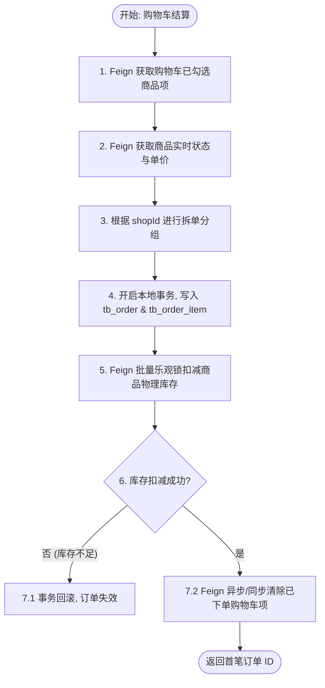
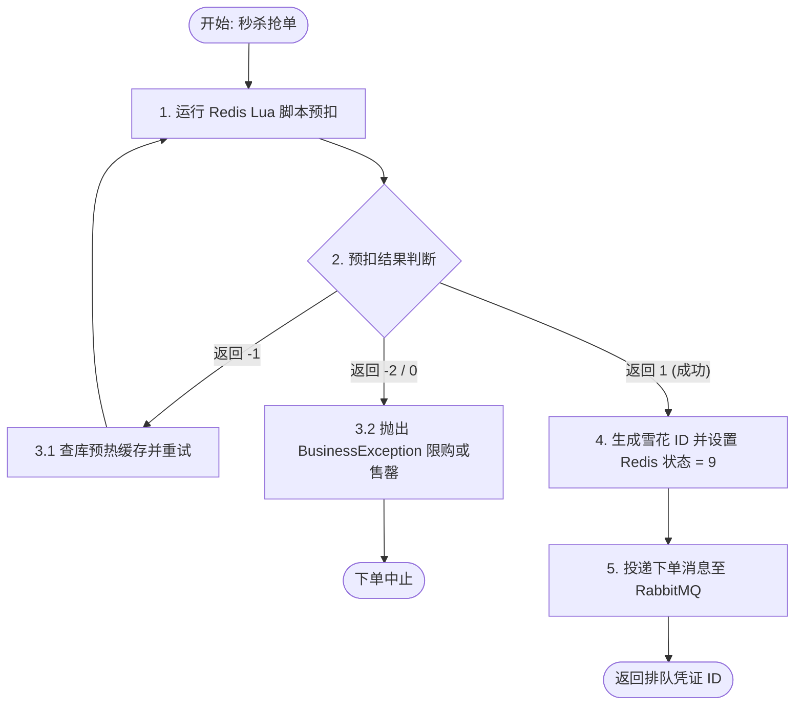

# 交易与高并发秒杀微服务 (o2o-trade-service) 核心业务与架构设计总结

本文档总结了智能 O2O 聚合电商平台中**交易与秒杀微服务**的核心业务逻辑、高并发秒杀架构设计、Redis Lua 库存预扣、RabbitMQ 异步建单与补偿机制，以及评价合法性校验联动设计，为开发运维及系统审计提供设计依据。

---

## 1. 业务与架构定位：交易核心，异步削峰

`o2o-trade-service`（运行端口 8083，Nacos 注册名 `o2o-trade-service`）是电商交易链路的核心。针对普通订单交易（追求强一致性、本地事务）与秒杀活动抢购（追求高吞吐量、低延迟、防超卖）的差异性，系统设计了物理隔离的双通道架构：

### 1.1 业务双通道设计

1. **普通订单通道（同步强一致）**：
   - 流程：购物车结算 -> RPC 校验价格与状态 -> 本地开启事务写表 -> RPC 乐观锁扣减物理库存 -> RPC 清空购物车。
   - 核心：确保价格、库存的绝对实时一致，采用数据库强事务和跨服务事务回滚控制。
2. **秒杀下单通道（异步削峰削频）**：
   - 流程：客户端请求 -> Redis Lua 脚本预扣/排重 -> 发送 MQ 队列 -> 快速响应排队中 -> 消费者异步落库建单。
   - 核心：抗高并发冲击，保护数据库底盘不被冲垮。通过内存快速拦截无效/超发流量。

---

## 2. 数据库设计与物理幂等保障 (MySQL)

交易数据库物理隔离命名为 `o2o_trade_db`，由 `o2o-trade-service` 独占。

### 2.1 数据库表结构定义

```sql
CREATE DATABASE IF NOT EXISTS `o2o_trade_db` CHARACTER SET utf8mb4 COLLATE utf8mb4_unicode_ci;
USE `o2o_trade_db`;

-- 1. 订单主表
DROP TABLE IF EXISTS `tb_order`;
CREATE TABLE `tb_order` (
  `id` bigint NOT NULL COMMENT '订单ID，分布式主键 (Snowflake)',
  `order_no` varchar(64) NOT NULL COMMENT '订单号，唯一标识',
  `user_id` bigint NOT NULL COMMENT '下单用户ID',
  `shop_id` bigint NOT NULL COMMENT '店铺ID',
  `total_amount` decimal(10,2) NOT NULL COMMENT '订单总金额',
  `actual_amount` decimal(10,2) NOT NULL COMMENT '实付金额',
  `status` tinyint NOT NULL DEFAULT '0' COMMENT '订单状态：0-待付款，1-已付款/待接单，2-配送中/待收货，3-已完成，4-已取消，5-已退款',
  `receiver_name` varchar(50) DEFAULT NULL COMMENT '收货人姓名',
  `receiver_phone` varchar(20) DEFAULT NULL COMMENT '收货人电话',
  `receiver_address` varchar(255) DEFAULT NULL COMMENT '详细地址',
  `order_type` tinyint NOT NULL DEFAULT '0' COMMENT '订单类型：0-普通订单，1-秒杀订单',
  `pay_time` datetime DEFAULT NULL COMMENT '支付时间',
  `cancel_time` datetime DEFAULT NULL COMMENT '取消时间',
  `complete_time` datetime DEFAULT NULL COMMENT '完成时间',
  `create_time` datetime NOT NULL DEFAULT CURRENT_TIMESTAMP COMMENT '创建时间',
  `update_time` datetime NOT NULL DEFAULT CURRENT_TIMESTAMP ON UPDATE CURRENT_TIMESTAMP COMMENT '更新时间',
  PRIMARY KEY (`id`),
  UNIQUE KEY `uni_order_no` (`order_no`), -- 唯一索引防止重复建单支付
  KEY `idx_user_id` (`user_id`),           -- 用户订单查询优化
  KEY `idx_shop_id` (`shop_id`),           -- 店铺订单查询优化
  KEY `idx_create_time` (`create_time`)
) ENGINE=InnoDB DEFAULT CHARSET=utf8mb4 COLLATE=utf8mb4_unicode_ci COMMENT='订单主表';

-- 2. 订单商品明细表
DROP TABLE IF EXISTS `tb_order_item`;
CREATE TABLE `tb_order_item` (
  `id` bigint NOT NULL AUTO_INCREMENT COMMENT '明细ID，自增主键',
  `order_id` bigint NOT NULL COMMENT '关联的订单ID',
  `goods_id` bigint NOT NULL COMMENT '商品ID',
  `goods_name` varchar(100) NOT NULL COMMENT '商品名称',
  `price` decimal(10,2) NOT NULL COMMENT '购买单价 (实际下单时的单价)',
  `quantity` int NOT NULL DEFAULT '1' COMMENT '购买数量',
  `image` varchar(255) DEFAULT NULL COMMENT '商品主图',
  `create_time` datetime NOT NULL DEFAULT CURRENT_TIMESTAMP COMMENT '创建时间',
  `update_time` datetime NOT NULL DEFAULT CURRENT_TIMESTAMP ON UPDATE CURRENT_TIMESTAMP COMMENT '更新时间',
  PRIMARY KEY (`id`),
  KEY `idx_order_id` (`order_id`)          -- 订单 ID 索引优化
) ENGINE=InnoDB DEFAULT CHARSET=utf8mb4 COLLATE=utf8mb4_unicode_ci COMMENT='订单商品明细表';

-- 3. 秒杀代金券/秒杀商品配置表
DROP TABLE IF EXISTS `tb_seckill_voucher`;
CREATE TABLE `tb_seckill_voucher` (
  `id` bigint NOT NULL COMMENT '秒杀券ID，对应 tb_goods 中的 id',
  `voucher_price` decimal(10,2) NOT NULL COMMENT '秒杀抢购优惠价 (如 1.00元)',
  `stock` int NOT NULL DEFAULT '0' COMMENT '秒杀物理库存',
  `start_time` datetime NOT NULL COMMENT '秒杀活动开始时间',
  `end_time` datetime NOT NULL COMMENT '秒杀活动结束时间',
  `create_time` datetime NOT NULL DEFAULT CURRENT_TIMESTAMP COMMENT '创建时间',
  `update_time` datetime NOT NULL DEFAULT CURRENT_TIMESTAMP ON UPDATE CURRENT_TIMESTAMP COMMENT '更新时间',
  PRIMARY KEY (`id`)
) ENGINE=InnoDB DEFAULT CHARSET=utf8mb4 COLLATE=utf8mb4_unicode_ci COMMENT='秒杀代金券配置表';
```

### 2.2 物理幂等性保证
* **雪花 ID 与唯一索引 `uni_order_no`**：订单主表主键不采用数据库自增 ID，而是在应用层生成雪花 ID。这确保了秒杀等异步场景在建单落库前即可反馈排队凭证给客户端。同时，`uni_order_no` 字段约束能确保高并发重试或双发请求时绝对不会创建重复订单。

---

## 3. 跨服务 RPC 库存扣减与最终一致性

为了符合“独占数据库 (Database-per-Service)”微服务规范，交易微服务不可以直接跨库更新商品库存。

### 3.1 批量物理库存扣减
在创建普通订单时，由 `o2o-trade-service` 调用 `o2o-api` 的 `GoodsClient#deductStock`：
- 下游的 `o2o-shop-service` 接收批量扣减列表并在其本库执行乐观锁扣减 SQL：
  ```sql
  UPDATE tb_goods SET stock = stock - #{quantity} WHERE id = #{goodsId} AND stock >= #{quantity}
  ```
- **事务与一致性控制**：扣减由 MyBatis-Plus 乐观锁行数控制（`updateCount <= 0` 时抛异常）。只要有一款商品物理库存扣减失败，整个扣减事务就会回滚，并向交易微服务反馈失败，确保全局数据一致。

### 3.2 联动缓存主动失效
在物理扣库存成功后，`o2o-shop-service` 自动调用 `CacheClient#delete`，使该商品的 Redis 详情缓存立刻失效：
- **保障读一致性**：下一次用户读取商品详情时，主动发生缓存未命中，利用分布式锁重新读取数据库扣减后的真实数据，彻底防范了“商品已被卖空，缓存中仍显示有货”的超卖认知偏差。

---

## 4. 高并发秒杀：Redis Lua + RabbitMQ 异步排队

秒杀属于“读多写少、瞬时极速高并发”场景。为了保护数据库底盘，秒杀下单并不直接穿透到 MySQL，而是在 Redis 中对虚拟库存进行预扣。

### 4.1 Redis 虚拟库存预扣与限购（Lua 脚本）
通过 Lua 脚本将“限购 1 件校验”与“扣减库存”封装为单个 Redis 原子命令：
```lua
local stockKey = KEYS[1]
local boughtKey = KEYS[2]
local userId = ARGV[1]
local quantity = tonumber(ARGV[2])

-- 1. 限购判定
local isBought = redis.call('sismember', boughtKey, userId)
if isBought == 1 then
    return -2 -- 限购超限
end

-- 2. 库存扣减
if redis.call('exists', stockKey) == 1 then
    local stock = tonumber(redis.call('get', stockKey))
    if stock >= quantity then
        redis.call('incrby', stockKey, -quantity)
        redis.call('sadd', boughtKey, userId)
        return 1  -- 成功
    else
        return 0  -- 库存不足
    end
else
    return -1 -- 未预热
end
```

### 4.2 RabbitMQ 异步削峰拓扑
Redis 预扣库存成功后，主流程给前端直接返回排队凭证 ID（雪花 ID），并将下单消息投递至 RabbitMQ。
- **Exchange**: `seckill.order.exchange` (Direct)
- **Queue**: `seckill.order.queue`
- **Routing Key**: `seckill.order.routing.key`
- **Payload**:
  ```json
  {
    "orderId": 1693849102938481,
    "userId": 128372,
    "voucherId": 99,
    "quantity": 1,
    "price": 1.00
  }
  ```

### 4.3 Redis 排队状态机
为保证异步建单对前端可追踪，系统在 Redis 中维护了临时的排队状态，Key 命名为 `o2o:seckill:order:status:{orderId}`：
- `9`：代表正在异步排队建单中。
- `-2`：代表库存不足，异步落库或扣减物理库存失败。
- **状态轮询与 fallback 策略**：前端轮询 `GET /trade/customer/seckill/status/{orderId}` 时：
  - 如果 Redis 中为 `9` 或 `-2`，则直接返回。
  - 如果 Redis 缓存已删除（建单成功后删除该 Key），则 Fallback 穿透查询 MySQL `tb_order`，读取订单的最终交易状态（如 `0-待付款` 等）。

---

## 5. 核心业务流程流转设计

### 5.1 普通订单创建流程



### 5.2 秒杀预下单流程



### 5.3 队列消费落库与补偿回滚流程

```mermaid
graph TD
    Start([收到 MQ 秒杀消息]) --> LocalVoucher[1. 乐观锁扣减本地 tb_seckill_voucher 物理库存]
    LocalVoucher --> CheckDeduct{2. 物理库存扣减成功?}
    
    CheckDeduct -- "否 (物理库存不足)" --> RollbackRedis[3.1 补偿回滚 Redis 虚拟库存 & 移除限购 Set]
    RollbackRedis --> SetFailState[3.2 更新 Redis 订单状态 = -2]
    
    CheckDeduct -- "是" --> FetchGoods[4.1 Feign 远程调用获取商品详情快照]
    FetchGoods --> LocalTX[4.2 本地事务写入 tb_order & tb_order_item]
    LocalTX --> CommitTX{4.3 数据库写入成功?}
    
    CommitTX -- "否 (数据库写入异常)" --> RollbackRedis
    CommitTX -- "是" --> DelState[5. 删除 Redis 中订单状态缓存 (轮询将穿透直查 DB)]
    DelState --> End([处理完成])
```

---

## 6. 评价合法性校验机制设计

为保障商品评价系统的真实性、防止水军刷量，评价校验端点 `/trade/order/verify-for-review` 从 Mock 升级为了真实的双表关联数据库校验：

1. **用户与订单过滤**：
   查询 `tb_order`，必须同时满足 `id = orderId`、`user_id = userId`，且订单状态处于 `1` (已付款)、`2` (配送中) 或 `3` (已完成) 状态，拦截任何未付款或他人伪造的订单。
2. **购买单品过滤**：
   查询 `tb_order_item` 表，校验是否存在 `order_id = orderId` 且 `goods_id = goodsId` 的明细记录，防止用其他订单代替当前商品刷好评。
3. **安全拦截**：若以上两步未通过，返回 `Result.ok(false)`，商品详情页的发表评论按钮将不可用，且接口提交时也会被 `o2o-shop-service` 拦截并拒绝。

---

## 7. 身份上下文透传与鉴权

- **拦截器隐式解析**：在 `WebMvcConfig` 中注册 `UserContextInterceptor`，全路径拦截所有传入请求。
- **安全过滤**：利用 `UserContext.getUserId()` 提取网关透传的 `X-User-Id` 头并绑定在 `ThreadLocal` 变量上。
- **控制层零入参**：普通下单接口一律使用 ThreadLocal 上下文解析身份，彻底杜绝了黑客篡改 `userId` 进行横向越权的重大安全隐患。
